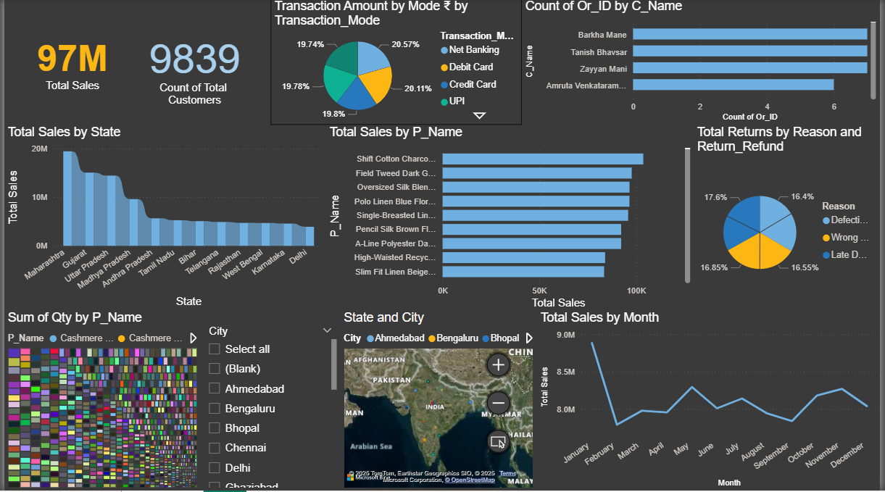

# AJIO Retail Analytics & Sales Forecasting Dashboard 📊

This project analyzes sales, customers, transactions, and returns data for AJIO (an e-commerce platform). It also includes forecasting models to predict future sales.

## 🔧 Tools Used
- Power BI (for Dashboard)
- Python (for data processing & forecasting)
- Pandas, Matplotlib, Seaborn, Prophet
- GitHub (for version control)

## 📁 Dataset Overview
The dataset includes:
- Orders (`orders.csv`)
- Products (`products.csv`)
- Customers (`customer.csv`)
- Transactions (`transaction.csv`)
- Ratings (`ratings.csv`)
- Returns (`returns.csv`)
- Delivery (`delivery.csv`)

## 🔍 Key Features
- 📈 Total Sales and Monthly Trends
- 🧍 Customer Distribution by State
- 📦 Top-Selling Products
- 💳 Payment Mode Analysis
- 🔁 Return Reasons
- 🕒 Delivery Delay Insights
- 🔮 Sales Forecast for Next 3 Months

## 📸 Dashboard Preview

## 🔮 Future Improvements
- Product recommendation engine
- LSTM-based time series forecasting
- Streamlit integration

## ✅ How to Use
1. Clone the repo
2. Load `.csv` files into Power BI Desktop
3. Run or customize the `.pbix` report

## 📫 Contact
- **Narendra S Chavan**
- 📧 narendrachavan451@gmail.com
- 🌐 [LinkedIn](https://www.linkedin.com/in/narendrachavan/)
